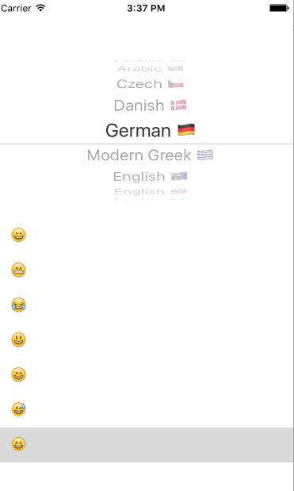

# iOS-emoji-speaks

I created this as a class assignment in Creating Coding Swift with Yuri Gitman at The New School. 
We created an application for iPhone 6 that uses a picker view and table view to select any emoji and speak in any language.  

